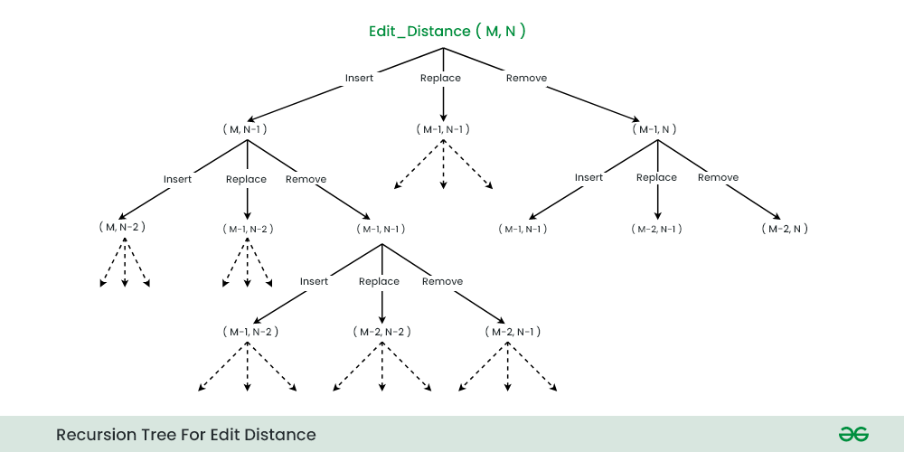
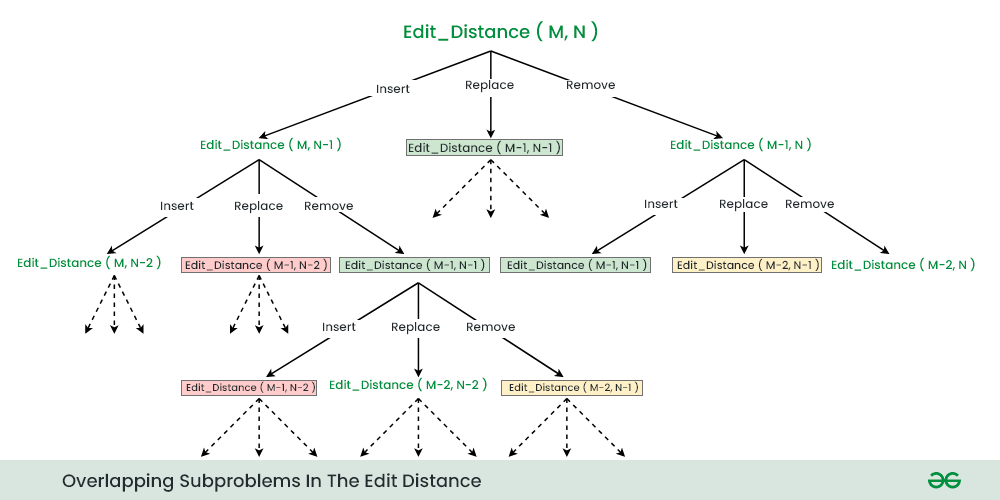

# EditDistance

Given two strings str1 and str2 of length M and N respectively and below operations that can be performed on str1. 
Find the minimum number of edits (operations) to convert ‘str1‘ into ‘str2‘.

* Operation 1 (INSERT): Insert any character before or after any index of str1
* Operation 2 (REMOVE): Remove a character of str1
* Operation 3 (Replace): Replace a character at any index of str1 with some other character.
* Note: All of the above operations are of equal cost.

## Examples:

Input:   str1 = “geek”, str2 = “gesek”
Output:  1

Explanation: We can convert str1 into str2 by inserting a ‘s’ between two consecutive ‘e’ in str2.

Input:   str1 = “cat”, str2 = “cut”
Output:  1

Explanation: We can convert str1 into str2 by replacing ‘a’ with ‘u’.

Input:   str1 = “sunday”, str2 = “saturday”
Output:  3

Explanation: Last three and first characters are same.  We basically need to convert “un” to “atur”.  This can be done using below three operations. Replace ‘n’ with ‘r’, insert t, insert a

## Recursion Concept

The idea is to process all characters one by one starting from either from left or right sides of both strings.

### Subproblems in Edit Distance:

Let us process from the right end of the strings, there are two possibilities for every pair of characters being traversed, either they match or they don’t match. 

If last characters of both string matches then there is no need to perform any operation So, recursively calculate the answer for rest of part of the strings. 

When last characters do not match, we can perform all three operations to match the last characters in the given strings, i.e. insert, replace, and remove. We then recursively calculate the result for the remaining part of the string. Upon completion of these operations, we will select the minimum answer.

When the last characters of strings matches. Make a recursive call EditDistance(M-1,N-1) to calculate the answer for remaining part of the strings.

When the last characters of strings don’t matches. Make three recursive calls as show below:

* Insert str1[N-1] at last of str2 : EditDistance(M, N-1)
* Replace str2[M-1] with str1[N-1] : EditDistance(M-1, N-1)
* Remove str2[M-1] : EditDistance(M-1, N)

### Recurrence Relations for Edit Distance

* EditDistance(str1, str2, M, N) = EditDistance(str1, str2, M-1, N-1)
* Case 1: When the last character of both the strings are same
* Case 2: When the last characters are different 
  * EditDistance(str1, str2, M, N) = 1 + Minimum{ EditDistance(str1, str2 ,M-1,N-1), EditDistance(str1, str2 ,M,N-1), EditDistance(str1, str2 ,M-1,N) }

### Base Case for Edit Distance
* Case 1: When str1 becomes empty i.e. M=0
  * return N, as it require N characters to convert an empty string to str1 of size N
* Case 2: When str2 becomes empty i.e. N=0
  * return M, as it require M characters to convert an empty string to str2 of size M

## Memoization
In the above recursive approach, there are several overlapping subproblems:
* Edit_Distance(M-1, N-1) is called Three times
* Edit_Distance(M-1, N-2) is called Two times
* Edit_Distance(M-2, N-1) is called Two times. And so on…

So, we can use Memoization technique to store the result of each subproblems to avoid recalculating the result again and again.

## Bottom-Up

1. __Choosing Dimensions of Table__: The state of smaller sub-problems depends on the input parameters m and n because at least one of them will decrease after each recursive call. So we need to construct a 2D table dp[][] to store the solution of the sub-problems.

2. __Choosing Correct size of Table__: The size of the 2D table will be equal to the total number of different subproblems, which is equal to (m + 1)*(n + 1). As both m and n are decreasing by 1 during the recursive calls and reaching the value 0. So m + 1 possibilities for the first parameter and n + 1 possibilities for the second parameter. Total number of possible subproblems = (m + 1)*(n + 1).

3. __Filling the table__: It consist of two stages, table initialization and building the solution from the smaller subproblems:

__Table initialization__: Before building the solution, we need to initialize the table with the smaller version of the solution i.e. base case. Here m = 0 and n = 0 is the situation of the base case, so we initialize first-column dp[i][0] with i and first-row dp[0][j] with j.

__Building the solution of larger problems from the smaller subproblems__: We can easily define the iterative structure by using the recursive structure of the above recursive solution.
  * if (str1[i – 1] == str2[j – 1]) dp[i][j] = dp[i – 1][j – 1];
  * if (str1[i – 1] != str2[j – 1]) dp[i][j] = 1 + min(dp[i][j – 1], dp[i – 1][j], dp[i – 1][j – 1]);
4. Returning final solution: After filling the table iteratively, our final solution gets stored at the bottom right corner of the 2-D table i.e. we return Edit[m][n] as an output.

