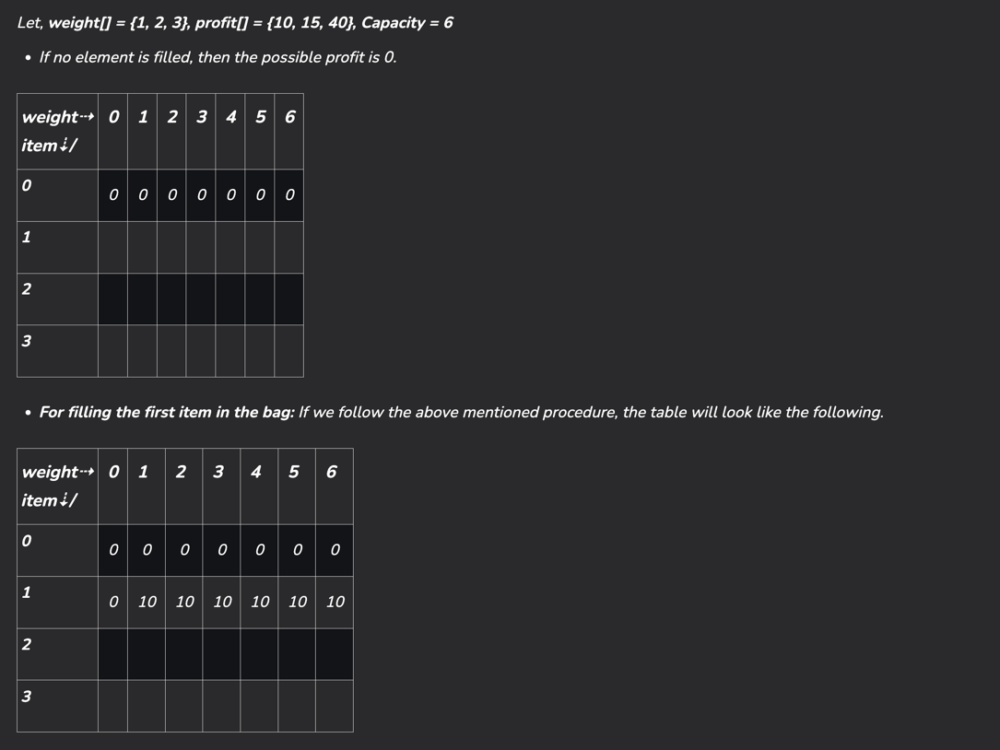
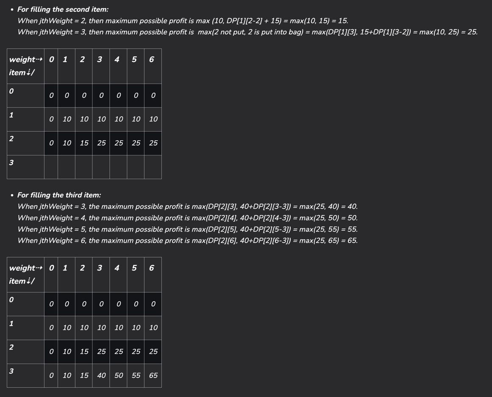

# 0-1 Knapsack

Given N items where each item has some weight and profit associated with it and also given a bag with capacity W, 
[i.e., the bag can hold at most W weight in it]. 

__The task is to put the items into the bag such that the sum of profits associated with them is the maximum possible.__

## Examples:

Input: N = 3, W = 4, profit[] = {1, 2, 3}, weight[] = {4, 5, 1}
Output: 3

Explanation: There are two items which have weight less than or equal to 4. 
If we select the item with weight 4, the possible profit is 1. 
And if we select the item with weight 1, the possible profit is 3. 
So the maximum possible profit is 3. 
Note that we cannot put both the items with weight 4 and 1 together as the capacity of the bag is 4.

## Recursion Concept

A simple solution is to consider all subsets of items and calculate the total weight and profit of all subsets. 
Consider the only subsets whose total weight is smaller than W. From all such subsets, pick the subset with maximum profit.

Optimal Substructure: To consider all subsets of items, there can be two cases for every item.
* Case 1: The item is included in the optimal subset.
* Case 2: The item is not included in the optimal set.

The maximum value obtained from ‘N’ items is the max of the following two values.

* Case 1 (include the Nth item): Value of the Nth item plus maximum value obtained by remaining N-1 items and remaining weight i.e. (W-weight of the Nth item).
* Case 2 (exclude the Nth item): Maximum value obtained by N-1 items and W weight.

If the weight of the ‘Nth‘ item is greater than ‘W’, then the Nth item cannot be included and Case 2 is the only possibility.

## Bottom-Up

