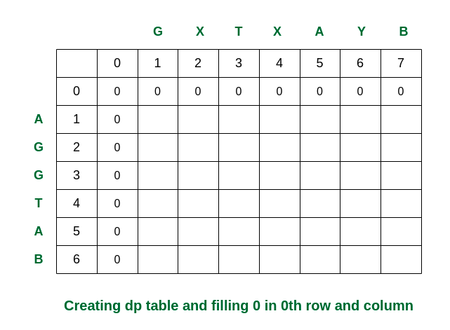

# Longest Common Subsequence

A longest common subsequence (LCS) is defined as __the longest subsequence which is common in all given input sequences__.

## Samples
Input: S1 = “AGGTAB”, S2 = “GXTXAYB”
Output: 4
**Explanation: The longest subsequence which is present in both strings is “GTAB”.**

Input: S1 = “BD”, S2 = “ABCD”
Output: 2
**Explanation: The longest subsequence which is present in both strings is “BD”.**

## Recursion Concept

* if last characters are same, recursively calculate 1 + substring without last char
* Otherwise, take max lcs of 
  * left substring (without last char) and right string
  * right substring (without last char) and left string
* Base case, both string are 0 length, which returns 0

__Complexity O(2m*n), Space O(1)__

## Memoization
If we notice carefully, we can observe that the above recursive solution holds the following two properties:

1. Optimal Substructure:
   See for solving the structure of L(X[0, 1, . . ., m-1], Y[0, 1, . . . , n-1]) we are taking the help of the substructures of X[0, 1, …, m-2], Y[0, 1,…, n-2], depending on the situation (i.e., using them optimally) to find the solution of the whole.

2. Overlapping Subproblems:
   If we use the above recursive approach for strings “BD” and “ABCD“, we will get a partial recursion tree as shown below. Here we can see that the subproblem L(“BD”, “ABCD”) is being calculated more than once. If the total tree is considered there will be several such overlapping subproblems.

                                     L(“AXYT”, “AYZX”)
                                 /                    \
                      L(“AXY”, “AYZX”)                         L(“AXYT”, “AYZ”)
           /                            \                 /                      \
        L(“AX”, “AYZX”)        L(“AXY”, “AYZ”)      L(“AXY”, “AYZ”)  L(“AXYT”, “AY”)

Approach: Because of the presence of these two properties we can use Dynamic programming or Memoization to solve the problem. 

* Initialize dp with -1
* Store each dp[m][n], approach is same as recursion

__Complexity O(m*n), Space O(m*n)__

## Bottom-Up (Tabulation)
* Create a 2D array dp[][] with rows and columns equal to the length of each input string plus 1 [the number of rows indicates the indices of S1 and the columns indicate the indices of S2].
* Initialize the first row and column of the dp array to 0.
* Iterate through the rows of the dp array, starting from 1 (say using iterator i). 
  * For each i, iterate all the columns from j = 1 to n:
    * If S1[i-1] is equal to S2[j-1], set the current element of the dp array to the value of the element to (dp[i-1][j-1] + 1).
    * Else, set the current element of the dp array to the maximum value of dp[i-1][j] and dp[i][j-1].
* After the nested loops, the last element of the dp array will contain the length of the LCS.

__Complexity O(m*n), Space O(m*n)__

## Bottom-Up (Space-Optimization):
* In the above tabulation approach we are using L[i-1][j] and L[i][j] etc, here the L[i-1] will refers to the matrix L’s previous row and L[i] refers to the current row.
* We can do space optimization by using two vectors one is previous and another one is current.
* When the inner for loop exits we are initializing previous equal to current.

__Complexity O(m*n), Space O(m)__
