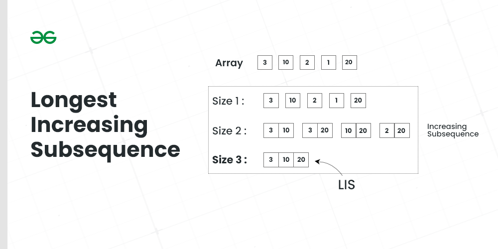
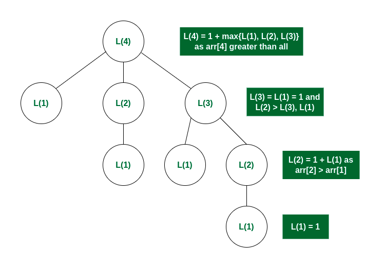

# Longest Increasing Subsequence

Given an array arr[] of size N, the task is to find the length of the Longest Increasing Subsequence (LCS) i.e., the longest possible subsequence in which the elements of the subsequence are sorted in increasing order.

## Samples
Input: arr[] = {3, 10, 2, 1, 20}

Output: 3

**Explanation: The longest increasing subsequence is 3, 10, 20**

Input: arr[] = {3, 2}

Output:1

**Explanation: The longest increasing subsequences are {3} and {2}**

Input: arr[] = {50, 3, 10, 7, 40, 80}

Output: 4

**Explanation: The longest increasing subsequence is {3, 7, 40, 80}**

## Recursion Concept

Let L(i) be the length of the **LCS ending at index i** such that arr[i] is the last element of the LCS. 
Then, L(i) can be recursively written as:
* L(i) = 1 + max(L(j) ) where 0 < j < i and arr[j] < arr[i] -- if arr[j] < arr[i], then new result is 1 + max (of all previous sub array lengths)    
* L(i) = 1, if no such j exists -- otherwise, also base case

**Formally, the length of LCS ending at index i, is 1 greater than the maximum of lengths of all LCS ending at some index j such that arr[j] < arr[i] where j < i.**

## Optimized version binary search O(n*logn)
For each number in nums, we perform the following steps:

* If the number is greater than the last element of the last bucket (i.e., the largest element in the current subsequence), we append the number to the end of the list. This indicates that we have found a longer subsequence.
* Otherwise, we perform a binary search on the list of buckets to find the smallest element that is greater than or equal to the current number. This step helps us maintain the property of increasing elements in the buckets.
* Once we find the position to update, we replace that element with the current number. This keeps the buckets sorted and ensures that we have the potential for a longer subsequence in the future.
