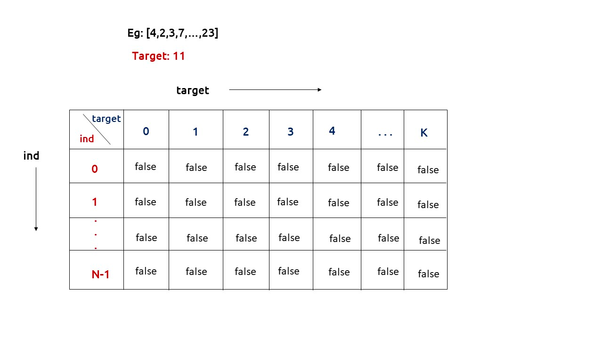
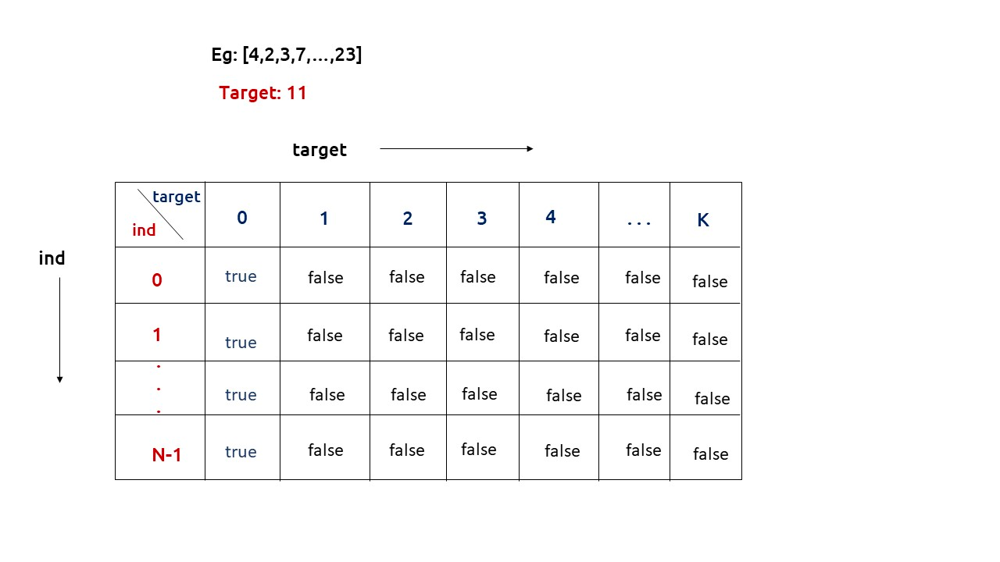
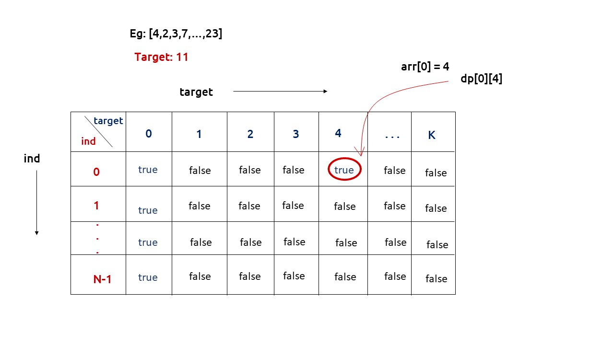
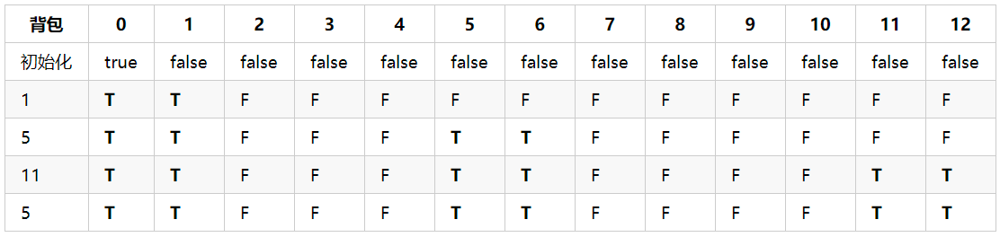

# Partition

The partition problem is to determine whether a given set can be partitioned into two subsets such that the sum of elements in both subsets is the same.

## Examples:

Input: arr[] = {1, 5, 11, 5}
Output: true

The array can be partitioned as {1, 5, 5} and {11}

Input: arr[] = {1, 5, 3}
Output: false

The array cannot be partitioned into equal sum sets.

## Concept

The following are the two main steps to solve this problem:

* Calculate the sum of the array. If the sum is odd, there can not be two subsets with an equal sum, so return false.
* If the sum of the array elements is even, calculate sum/2 and find a subset of the array with a sum equal to sum/2.

## Recursion Concept

* First, check if the sum of the elements is even or not
* After checking, call the recursive function isSubsetSum with parameters as input array, array size, and sum/2 
  * If the sum is equal to zero then return true (Base case)
  * If n is equal to 0 and sum is not equal to zero then return false (Base case)
  * Check if the value of the last element is greater than the remaining sum then call this function again by removing the last element
  * else call this function again for both the cases stated above and return true, if anyone of them returns true

## Bottom-Up

The problem can be solved using dynamic programming when the sum of the elements is not too big. As the recomputations of the same subproblems can be avoided by constructing a temporary array part[][] in a bottom-up manner using the above recursive formula and it should satisfy the following formula:

part[i][j] = true if a subset of {arr[0], arr[1], ..arr[j-1]} has sum equal to i, otherwise false

* First, check if the sum of the elements is even or not
* Declare a 2-D array part[][] of size (sum/2)+1 * (N + 1)
* Run a for loop for 0 <= i <= n and set part[0][i] equal to true as zero-sum is always possible
* Run a for loop for 1 <= i <= sum/2 and set part[i][0] equal to zero as any sum with zero elements is never possible
* Run a nested for loop for 1 <= i <= sum/2 and 1 <= j <= N 
  * Set part[i][j] equal to part[i][j-1]
  * If i is greater than or equal to arr[j-1], if part[i – arr[j-1]][j-1] is true then set part[i][j] as true

First, we need to initialize the base conditions of the recursive solution

If target == 0, ind can take any value from 0 to n-1, therefore we need to set the value of the first column as true.

The first-row dp[0][] indicates that only the first element of the array is considered, therefore for the target value equal to arr[0], only the cell with that target will be true, so explicitly set dp[0][arr[0]] =true, (dp[0][arr[0]] means that we are considering the first element of the array with the target equal to the first element itself). 
Please note that it can happen that arr[0]>target, so we first check it: if(arr[0]<=target) then set dp[0][arr[0]] = true.

Example 1:
Input: [1, 5, 11, 5]
Output: true
Explanation: The array can be partitioned as [1, 5, 5] and [11].

