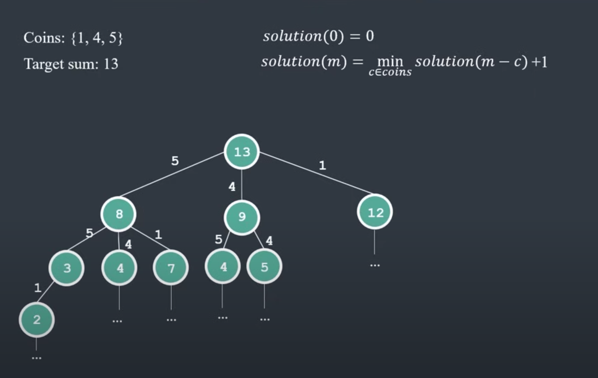

# Coin Problem -- minimum coins

Given a set of coins values voins ={c1, c2, ..., ck} and a target sum of money m, what is the minimum number of coins that form the sum m?

Input: coins[] = {25, 10, 5}, V = 30
Output: Minimum 2 coins required We can use one coin of 25 cents and one of 5 cents

Input: coins[] = {9, 6, 5, 1}, V = 11
Output: Minimum 2 coins required We can use one coin of 6 cents and 1 coin of 5 cents

This problem is a variation of the problem discussed Coin Change Problem. 

Here instead of finding the total number of possible solutions, we need to find the solution with the minimum number of coins.

The minimum number of coins for a value V can be computed using the below recursive formula.

If V == 0:
0 coins required
If V > 0:
minCoins(coins[0..m-1], V ) = min { 1 + minCoins(V-coin[i])} where, 0 <=i <= m-1 and coins[i] <= V.

__Problem:__
min_coins(coins, m) = ?

__Base Problem:__
min_coins(coins, 0) = 0
* If the target sum (sum) is 0, there is only one way to make the sum, which is by not selecting any coin. So, count(0, coins, n) = 1.
* If the target sum (sum) is negative or no coins are left to consider (n == 0), then there are no ways to make the sum, so count(sum, coins, 0) = 0.

__Recurrence Relation__:
min_coins(coins,m) = min(coins,n,sum-count[n-1]) + count(coins,n-1,sum)

## Recursive approach

