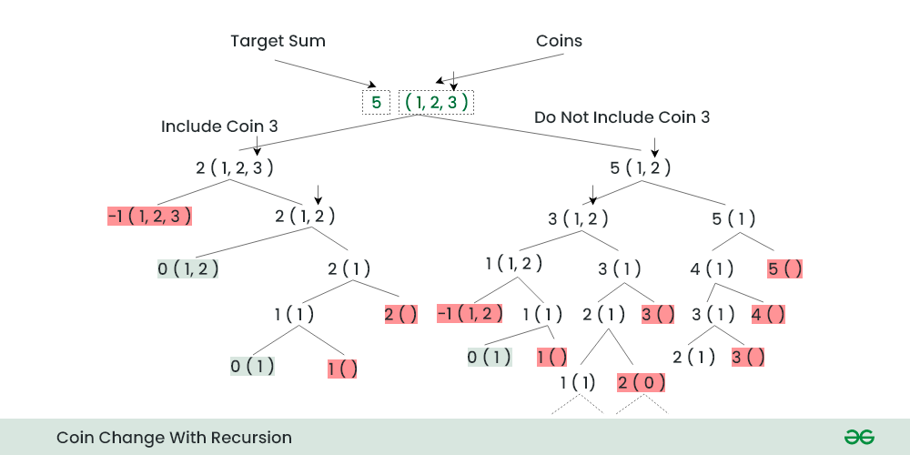

# Count number of coins required to make a given value

Given an integer array of coins[ ] of size N representing different types of denominations and an integer sum, the task is to count the number of coins required to make a given value sum.  

Input: sum = 4, coins[] = {1,2,3},
Output: 4
Explanation: there are four solutions: {1, 1, 1, 1}, {1, 1, 2}, {2, 2}, {1, 3}.

Input: sum = 10, coins[] = {2, 5, 3, 6}
Output: 5
Explanation: There are five solutions:
{2,2,2,2,2}, {2,2,3,3}, {2,2,6}, {2,3,5} and {5,5}.

__Problem:__
min_coins(coins, m) = ?

__Base Problem:__
min_coins(coins, 0) = 0
* If the target sum (sum) is 0, there is only one way to make the sum, which is by not selecting any coin. So, count(0, coins, n) = 1.
* If the target sum (sum) is negative or no coins are left to consider (n == 0), then there are no ways to make the sum, so count(sum, coins, 0) = 0.

__Recurrence Relation__:
count(coins,n,sum) = count(coins,n,sum-count[n-1]) + count(coins,n-1,sum)

For each coin, there are 2 options.

* Include the current coin: Subtract the current coin’s denomination from the target sum and call the count function recursively with the updated sum and the same set of coins i.e., count(coins, n, sum – coins[n-1] )
* Exclude the current coin: Call the count function recursively with the same sum and the remaining coins. i.e., count(coins, n-1, sum).

* The final result will be the sum of both cases.

## Recursive approach

