# Traversal

## Tree
A Tree Data Structure can be traversed in following ways:

* Depth First Search or DFS
    * Inorder Traversal
     * Preorder Traversal
    * Postorder Traversal
* Level Order Traversal or Breadth First Search or BFS
  * The main idea of level order traversal is to traverse all the nodes of a lower level before moving to any of the nodes of a higher level. This can be done in any of the following ways:
  * the naive one (finding the height of the tree and traversing each level and printing the nodes of that level) efficiently using a queue.
* Boundary Traversal
* Diagonal Traversal

## Graph

Depth First Traversal (or DFS) for a graph is similar to Depth First Traversal of a tree. 
The only catch here is, that, unlike trees, graphs may contain cycles (a node may be visited twice). 
To avoid processing a node more than once, use a boolean visited array. 
A graph can have more than one DFS traversal.

# How does DFS work?
Depth-first search is an algorithm for traversing or searching tree or graph data structures. 
The algorithm starts at the root node (selecting some arbitrary node as the root node in the case of a graph) and explores as far as possible along each branch before backtracking.

* Step1: Initially stack and visited arrays are empty.

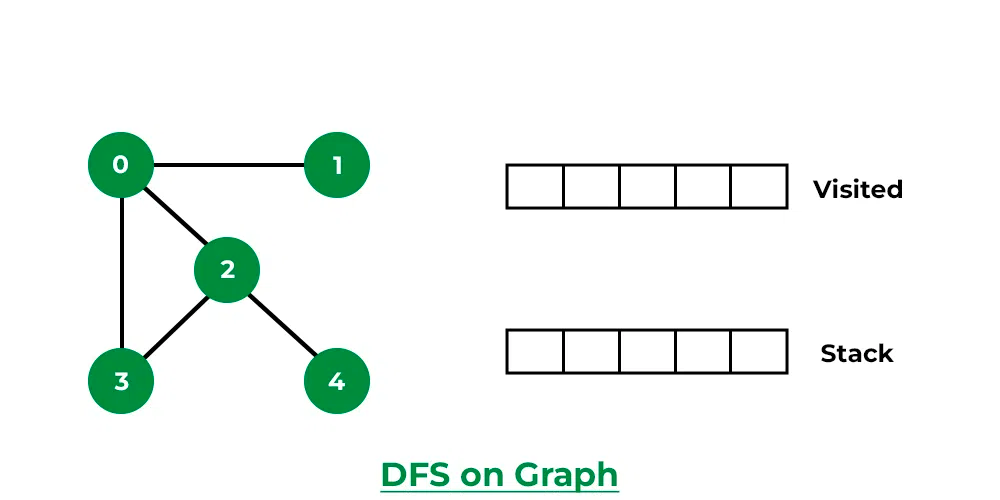

* Visit 0 and put its adjacent nodes which are not visited yet into the stack.

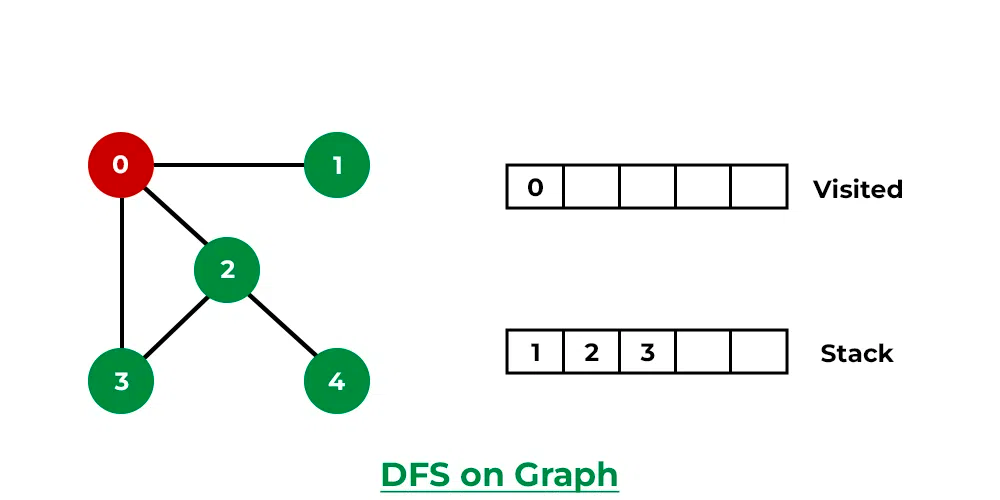

* Step 3: Now, Node 1 at the top of the stack, so visit node 1 and pop it from the stack and put all of its adjacent nodes which are not visited in the stack.

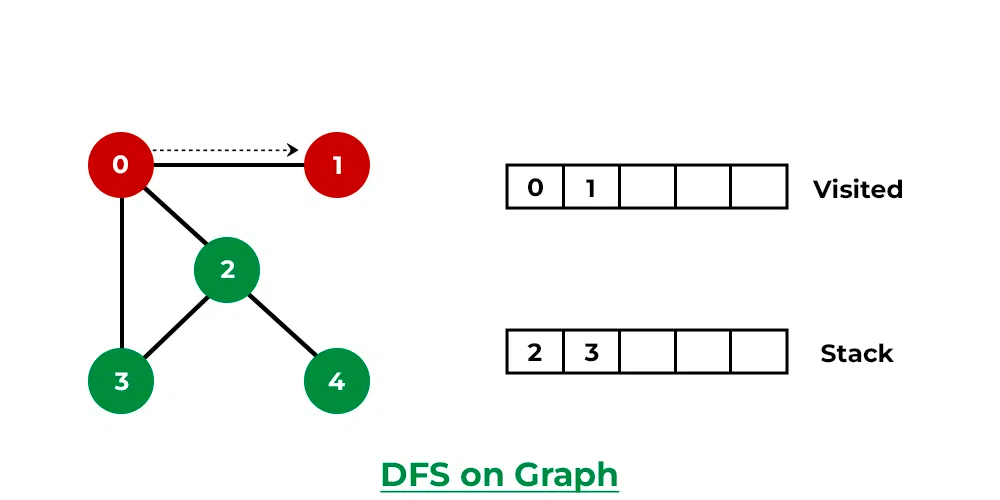

* Step 4: Now, Node 2 at the top of the stack, so visit node 2 and pop it from the stack and put all of its adjacent nodes which are not visited (i.e, 3, 4) in the stack.

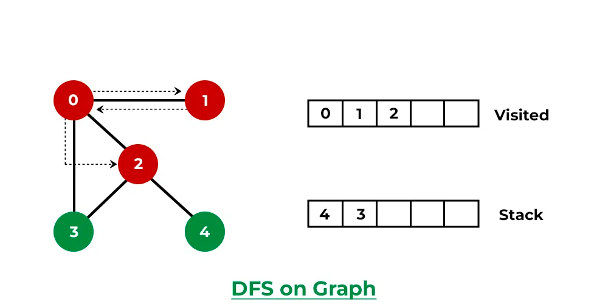

* Step 5: Now, Node 4 at the top of the stack, so visit node 4 and pop it from the stack and put all of its adjacent nodes which are not visited in the stack.

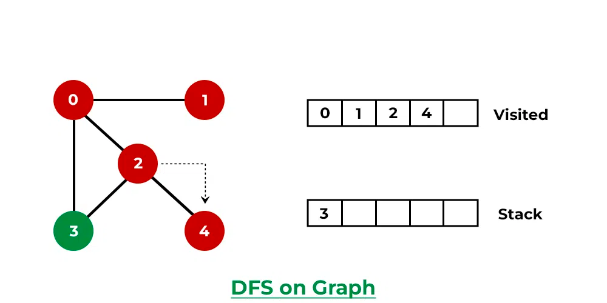

* Step 6: Now, Node 3 at the top of the stack, so visit node 3 and pop it from the stack and put all of its adjacent nodes which are not visited in the stack.

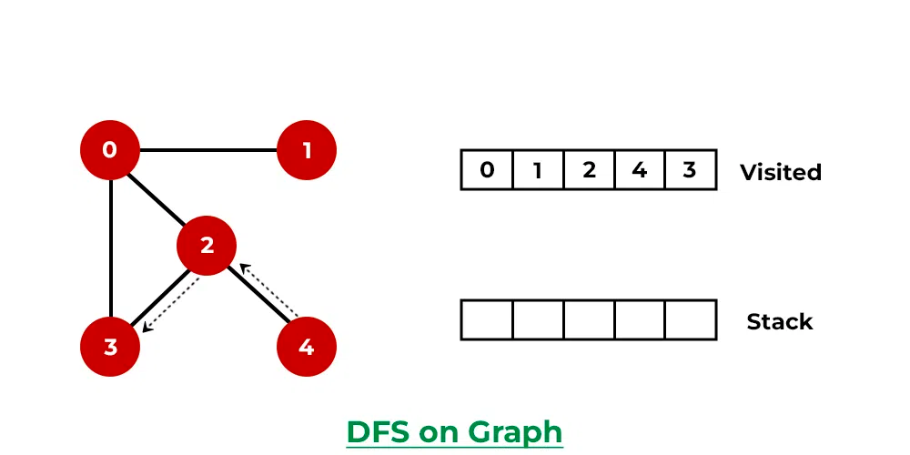

# How does BFS work?
Starting from the root, all the nodes at a particular level are visited first and then the nodes of the next level are traversed till all the nodes are visited.

To do this a queue is used. All the adjacent unvisited nodes of the current level are pushed into the queue and the nodes of the current level are marked visited and popped from the queue.

* Step1: Initially queue and visited arrays are empty.

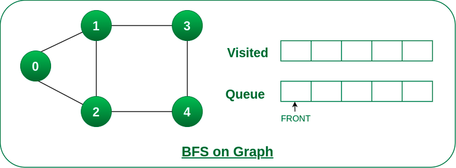

* Step 2: Push node 0 into queue and mark it visited.

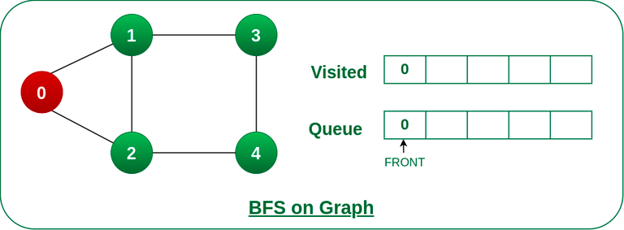

* Step 3: Remove node 0 from the front of queue and visit the unvisited neighbours and push them into queue.

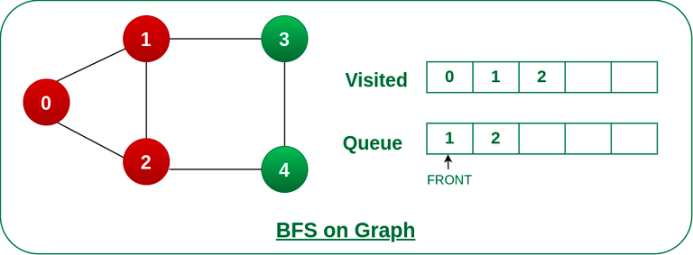

* Step 4: Remove node 1 from the front of queue and visit the unvisited neighbours and push them into queue.

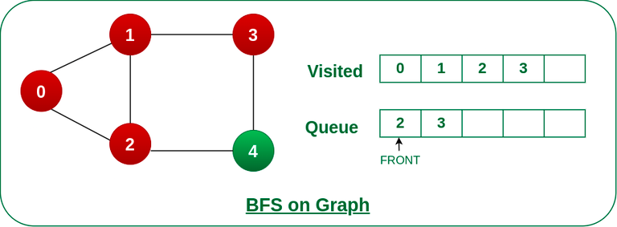

* Step 5: Remove node 2 from the front of queue and visit the unvisited neighbours and push them into queue.

* Step 6: Remove node 3 from the front of queue and visit the unvisited neighbours and push them into queue.
  As we can see that every neighbours of node 3 is visited, so move to the next node that are in the front of the queue.

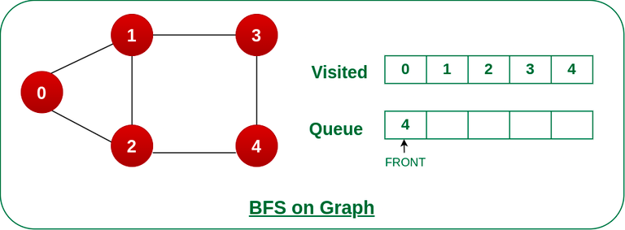

* Steps 7: Remove node 4 from the front of queue and visit the unvisited neighbours and push them into queue.
  As we can see that every neighbours of node 4 are visited, so move to the next node that is in the front of the queue.

